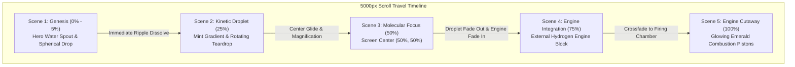

# NAMO Hydrogen — Complete Scroll Motion Architecture & Stitch AI Design Blueprint

This document specifies the complete end-to-end flow of the **NAMO Hydrogen** scrollytelling experience. It provides exact technical coordinates, timeline milestones, visual layer transformations, and UI placement zones for each stage (from Landing Page to Final Engine Cutaway) to guide the generation and integration of UI elements in **Stitch AI**.

---

## 1. Executive Motion Architecture



### Core Technical Pillars:
1. **Lenis Inertia Virtual Scroll**: Normalizes wheel, trackpad, and touch input into smooth, physics-based scroll deltas (`duration: 1.4s`, custom cubic-bezier ease).
2. **Pinned Stage (`#pin-stage`)**: The viewport stays locked (`100vw` × `100vh`) for `5000px` of virtual scroll travel while visual layers transform internally.
3. **Responsive Coordinate Normalization (`getRenderedMetrics`)**: Calculates exact `renderedW`, `renderedH`, `offsetX`, and `offsetY` for the source aspect ratio (`1672:941`), ensuring subpixel droplet alignment regardless of screen resolution.
4. **Hardware-Accelerated Frame Engine**: Uses an HTML5 `<canvas>` rendering 60 transparent WebP frames with a cosine S-curve seamless loop and subframe crossfading.
5. **Dual Rotation Model**:
   - **Idle State**: Rotates very slowly (~4.8 frames/sec) for a calm, luxurious aesthetic.
   - **Scroll Active**: Rotates at a gentle `0.015` multiplier driven by scroll speed.

---

## 2. Complete Scene-by-Scene Flow & UI Blueprint

---

### Scene 1: Genesis / Molecular Inception (Scroll: 0% – 5% | 0px – 250px)

```
+-------------------------------------------------------------+
| [Header: NAMO HYDROGEN | 01 02 03 04 05]                    |
|                                                             |
|  [STITCH UI ZONE A]                      [Hero Droplet]     |
|  Primary Brand Headline                  (x: 70.1%, y: 33%) |
|  Clean Energy Tagline                                       |
|  Primary Action CTA                                         |
|                                              |              |
|                                     [Water Spout Base]      |
|  [STITCH UI ZONE B]                                         |
|  Molecular Purity Badge              (Ripples in Basin)     |
|                                                             |
|                  [Scroll Down Indicator]                    |
+-------------------------------------------------------------+
```

* **Visual State**: High-speed impact of a water droplet creating concentric ripples and a vertical water column.
* **Background Layer**: `#layer-1` (`scene1-genesis.png` at `opacity: 1`).
* **Droplet State**: `#drop-1` (isolated spherical drop) locked precisely atop the water spout at `p1(x: 70.15%, y: 33.15%)`, size: `82px`.
* **Motion on Scroll Start**:
  - The instant scroll begins, `#layer-1` dissolves with high power (`power3.out`, duration `0.10`), eliminating the water spout and ripples.
  - `#drop-1` dissolves into the canvas teardrop (`dropletCanvas`).
* **Recommended Stitch AI UI Elements**:
  * **Top Header**: Floating glass pill navigation with NAMO emblem, progress stepper, and "Investor / Specs" links.
  * **Zone A (Left Column, x: 8% – 45%)**:
    * Display Headline: `Zero-Emission Supersonic Propulsion`
    * Subhead: `Direct On-Board Water-to-Hydrogen Catalysis.`
    * Action Pill: `EXPLORE ARCHITECTURE ->`
  * **Zone B (Bottom Left, x: 8% – 35%)**:
    * Monospace Spec Badge: `H2_PURITY // 99.999% | THERMAL_EFF // 54.2%`

---

### Scene 2: Pure Kinetic Hydrogen Droplet (Scroll: 25% | ~1250px)

```
+-------------------------------------------------------------+
| [Header: NAMO HYDROGEN | --01-- [02] 03 04 05]              |
|                                                             |
|  [STITCH UI ZONE C]                                         |
|  "MOLECULAR PURITY"                      [Spinning Droplet] |
|  - On-Demand Cracking                    (x: 69.5%, y: 57%) |
|  - Zero Storage Hazard                   Seamless Loop Spin |
|  - Atmospheric Recovery                                     |
|                                                             |
|  [Telemetry Card: H2 Yield]                                 |
+-------------------------------------------------------------+
```

* **Visual State**: Clean, serene mint gradient background (`clean-gradient-bg.png`). The water spout and ripples are 100% gone.
* **Background Layer**: `#layer-gradient` (`clean-gradient-bg.png` at `opacity: 1`).
* **Droplet State**:
  - The droplet is fully converted into the high-definition crystal teardrop.
  - Resting at `p2(x: 69.5%, y: 57.2%)`, size: `92px`.
  - Continuously spinning in a seamless loop with interior micro-bubbles and glass refractions.
* **Recommended Stitch AI UI Elements**:
  * **Zone C (Left Column, x: 8% – 48%)**:
    * Section Kicker: `02 // MOLECULAR EXTRACTION`
    * Headline: `Liquid Purity Meets Kinetic Velocity`
    * Feature Bullet Matrix:
      - `Closed-Loop DSHFG Catalytic Splitting`
      - `Ambient Air Recovery & Zero Waste Byproduct`
      - `Zero High-Pressure Storage Vessel Requirement`
    * Telemetry Module Card: Real-time cracking speed (`14.2 L/min`), Molecular density gauge (`0.08988 g/L`).

---

### Scene 3: Molecular Focus & Dynamic Expansion (Scroll: 50% | ~2500px)

```
+-------------------------------------------------------------+
| [Header: NAMO HYDROGEN | 01 02 [03] 04 05]                  |
|                                                             |
|  [STITCH UI ZONE D1]         [DROLET IN FOCUS]   [ZONE D2]  |
|  Stoichiometric Ratio       Center (50%, 50%)    Combustion |
|  14.7 : 1                   Magnified (165px)    Dynamics   |
|  Cryogenic Precision                             Laser Ignition
|                                                             |
|                 [Radial Telemetry Reticle]                  |
+-------------------------------------------------------------+
```

* **Visual State**: Pure mint gradient (`clean-gradient-bg.png`) with ambient rising micro-particles.
* **Background Layer**: `#layer-gradient` remains active.
* **Droplet State**:
  - The droplet glides gracefully from `p2` to the exact screen center `p3(x: 50%, y: 50%)`.
  - Scales up to magnified focus (size: `165px`).
  - Fluid loop animation continues without interruption, illuminated by a radial emerald halo.
* **Recommended Stitch AI UI Elements**:
  * **Zone D1 (Left Flank, x: 6% – 30%)**:
    * Data Metric: `14.7 : 1` — *Stoichiometric Hydrogen Induction Ratio*.
    * Detail Card: *Sub-millisecond molecular metering.*
  * **Zone D2 (Right Flank, x: 70% – 94%)**:
    * Data Metric: `3,200 m/s` — *Supersonic Flame Propagation Speed*.
    * Detail Card: *Ultra-lean burn mode with zero NOx output.*
  * **Center Overlay (Behind/Around Droplet)**:
    * Subtle circular technical HUD reticle with degree ticks and compass calibration markings.

---

### Scene 4: Engine Integration & Cylinder Landing (Scroll: 75% | ~3750px)

```
+-------------------------------------------------------------+
| [Header: NAMO HYDROGEN | 01 02 03 [04] 05]                  |
|                                                             |
|  [STITCH UI ZONE E1]                                        |
|  Propulsion Architecture                                    |
|  Bespoke Monoblock Alloy        [ENGINE BLOCK ASSEMBLY]     |
|                                 (Pre-rendered droplet on    |
|                                  cylinder head, canvas      |
|  [STITCH UI ZONE E2]             droplet hidden)            |
|  Engine Blueprint Metrics                                   |
+-------------------------------------------------------------+
```

* **Visual State**: High-precision, CNC-machined supersonic hydrogen internal combustion engine.
* **Background Layer**: `#layer-4` (`scene4-engine-drop.png` fades in to `opacity: 1`).
* **Droplet State**:
  - **The kinetic canvas droplet is COMPLETELY HIDDEN (`opacity: 0`)** as requested.
  - The engine artwork itself features the droplet landed directly upon the cylinder intake head, providing seamless narrative continuity.
* **Recommended Stitch AI UI Elements**:
  * **Zone E1 (Top Left / Overlay, x: 8% – 40%)**:
    * Section Kicker: `04 // PROPULSION ARCHITECTURE`
    * Headline: `The Supersonic Hydrogen IC Engine`
    * Monospace Specs:
      * `DISPLACEMENT // 4.8L V8 MONOBLOCK`
      * `POWER OUTPUT // 780 BHP @ 8,500 RPM`
      * `INDUCTION // DIRECT CYLINDER SUPERSONIC INJECTION`
  * **Zone E2 (Bottom Left, x: 8% – 35%)**:
    * Action Link: `VIEW TECHNICAL WHITE PAPER [PDF] ->`

---

### Scene 5: Combustion Chamber Cutaway (Scroll: 100% | ~5000px)

```
+-------------------------------------------------------------+
| [Header: NAMO HYDROGEN | 01 02 03 04 [05]]                  |
|                                                             |
|  [STITCH UI ZONE F1]               [CUTAWAY FIRING CORE]    |
|  Kinetic Ignition Cycle            Pistons illuminated      |
|  Zero Carbon / Pure H2O Exhaust    with pulsing emerald     |
|                                    combustion glow          |
|                                                             |
|  [STITCH UI ZONE F2: Full Interactive Drawer / CTA]         |
+-------------------------------------------------------------+
```

* **Visual State**: Cutaway cross-section of the engine showing the internal piston cylinder chambers firing with glowing emerald kinetic energy.
* **Background Layer**: `#layer-5` (`scene5-engine-cutaway.png` crossfades in to `opacity: 1`).
* **Droplet State**: Remains hidden (`opacity: 0`). Focus is 100% on the internal mechanical firing.
* **Recommended Stitch AI UI Elements**:
  * **Zone F1 (Top Left, x: 8% – 42%)**:
    * Headline: `Kinetic Energy. Pure Water Exhaust.`
    * Copy: `High-pressure catalytic reaction produces zero hydrocarbons, zero carbon monoxide, and zero particulate matter. Exhaust byproduct: pure, potable water.`
  * **Zone F2 (Bottom Full Width, x: 8% – 92%)**:
    * Floating Glass Control Deck:
      * Metric 1: `0.00 g/km` CO2 Output
      * Metric 2: `68%` Peak Thermal Efficiency
      * Metric 3: `1,200 km` Operational Range
    * Primary CTA: `SCHEDULE FLEET INTEGRATION DEMO`
    * Secondary CTA: `DOWNLOAD OEM SPECIFICATION DECK`

---

## 3. Stitch AI Color, Typography & Component Tokens

When generating UI components in Stitch AI (Project `16212578903340410525`), use the following design system tokens:

### Color System
| Token Name | Hex Value | Usage |
|---|---|---|
| **Primary Electric Cyan** | `#00E5FF` | High-voltage metrics, active step glow, primary button hover |
| **Kinetic Green** | `#0EA66E` / `#00E599` | Ambient glow, efficiency badges, progress bar fills |
| **Glass Surface Base** | `rgba(255, 255, 255, 0.75)` | Floating glass cards, navigation container (blur: 20px) |
| **Deep Text** | `#0A1510` | Primary display headlines and high-contrast labels |
| **Muted Slate Text** | `#728A7E` | Secondary body text, inactive step numbers, captions |
| **Mint Ambient Substrate**| `#EEF5F0` / `#F0F6F2` | Page background tone matching `clean-gradient-bg.png` |

### Typography Tokens
* **Headline / Display**: `Space Grotesk`, Weights: `700`, `600`, Letter-spacing: `-0.02em`
* **Body / Description**: `Manrope`, Weights: `400`, `500`, Line-height: `1.6`
* **Telemetry / Badges**: `JetBrains Mono`, Weights: `600`, `500`, Letter-spacing: `0.06em` (all-caps)

---

## 4. Ready-to-Use Prompts for Stitch AI Generation

Use these prompts directly in Stitch AI to generate individual UI components or full overlays:

### Prompt 1: Floating Glass Telemetry HUD Card (Scene 2 & 3)
> *"Design a modern, ultra-luxury floating glass telemetry card for an advanced clean hydrogen vehicle website. Background should be frosted white glass (rgba(255,255,255,0.8) with 24px backdrop blur, subtle border rgba(255,255,255,0.9), and soft diffuse shadow). Use Space Grotesk for the metric '14.7 : 1' and JetBrains Mono for the label 'STOICHIOMETRIC_RATIO'. Include a glowing emerald green indicator dot and a clean linear progress bar showing molecular efficiency at 99.98%."*

### Prompt 2: Technical Propulsion Specs Deck (Scene 4 & 5)
> *"Design a minimalist technical specification panel for a supersonic hydrogen combustion engine. Left side contains displacement (4.8L V8), power output (780 BHP), and fuel type (Zero-Emission H2). Use JetBrains Mono for monospace parameter labels and Space Grotesk for the values. Rounded corners (16px), frosted glass aesthetic with subtle green accents (#0EA66E), and two action buttons: 'SCHEDULE FLEET TRIAL' (solid emerald) and 'DOWNLOAD OEM SPECS' (glass outline)."*

### Prompt 3: Minimalist Top Navigation & Stepper
> *"Create a floating pill-shaped top header bar with rounded-full border. Left has a glowing circular 'H2' badge and 'NAMO HYDROGEN' in bold uppercase Space Grotesk. Center has a 5-step numbered indicator (01 Genesis, 02 Molecule, 03 Focus, 04 Engine, 05 Power). Right has an 'INQUIRE' pill button. Glassmorphism styling with backdrop blur."*
